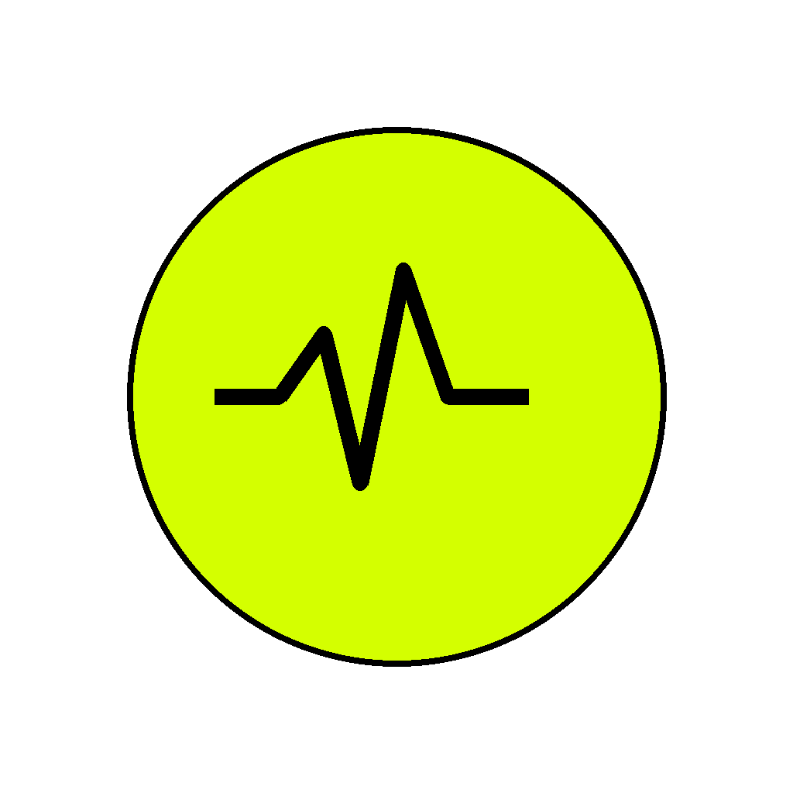

#  GlucoSync - Metabolic Nutrition MVP

GlucoSync is a mobile MVP that helps users make better food decisions using AI-powered meal understanding, glucose-aware guidance, and adaptive planning.

This build is intentionally scoped as an **MVP**: core flows are working end-to-end, while deeper production integrations (full CGM vendor pipelines, clinical validation layers, enterprise deployment paths) are planned next.

## Demo Video

- Watch demo: [YouTube walkthrough](https://youtu.be/GnKCfzjoyLk)

## Why this app

- Predicts likely meal impact, not just calories after the fact.
- Supports low-friction logging with image, voice, and text.
- Adapts plans when users deviate from routine.
- Includes GLP-1-aware coaching and protein-focused nudges.

## MVP Features

- 🏠 **Dashboard**: glucose snapshot, daily meal progress, timing intelligence, pattern memory.
- 📸 **Lens**: log meals via camera/gallery, voice, or typed fallback.
- 🎙️ **Voice Agent**: conversational logging, status checks, plan actions, TTS response.
- 🗓️ **Plan + Swap**: generate weekly meals and swap quickly when preferences change.
- 🛒 **Cart**: consolidated grocery list with native share + copy actions.
- 📈 **History**: trend graph, meal timeline, editable nutrition details.
- ⚙️ **Settings**: profile preferences, connectivity checks, and full account reset.

## User Journey (MVP)

- Sign in with email OTP and finish onboarding.
- Log meals from Lens using photo, voice, or text.
- Get predicted impact + immediate action suggestions.
- Generate/swap meal plans based on your day.
- Use Cart to execute groceries.
- Review History to improve consistency over time.

## Screenshots

.jpeg)
.jpeg)
.jpeg)
.jpeg)
.jpeg)
.jpeg)
.jpeg)


## Tech Stack (what + why)

- **Expo + React Native**: one codebase, fast iteration for iOS and Android.
- **Expo Router**: clean file-based navigation for multi-screen flows.
- **Supabase Auth**: simple and reliable OTP auth flow.
- **Supabase Postgres**: structured data for logs, plans, profiles, and analytics.
- **Supabase RLS**: strict per-user data protection at DB level.
- **Supabase Storage**: secure image/audio storage for user-generated assets.
- **Supabase Edge Functions**: server-side AI orchestration and secret safety.
- **Groq Cloud**: fast inference for meal parsing, planning, and voice logic.
- **ElevenLabs**: natural TTS for better conversational UX.
- **Pollinations**: low-cost generated fallback thumbnails.
- **TypeScript**: safer refactors and stronger app/backend contracts.
- **EAS Update + Build**: OTA updates and cloud builds for easy sharing.

## Run Locally

```bash
npm install
npx expo start
```

Required env values in `.env`:

- `EXPO_PUBLIC_SUPABASE_URL`
- `EXPO_PUBLIC_SUPABASE_ANON_KEY`
- `EXPO_PUBLIC_POLLINATIONS_KEY` (optional but recommended)

## Submission / Share

- Expo Go (iOS + Android):

```bash
npx eas-cli@latest update --branch preview --platform all --message "Submission latest MVP"
```

- Android installable build:

```bash
npx eas-cli@latest build --platform android --profile preview
```
